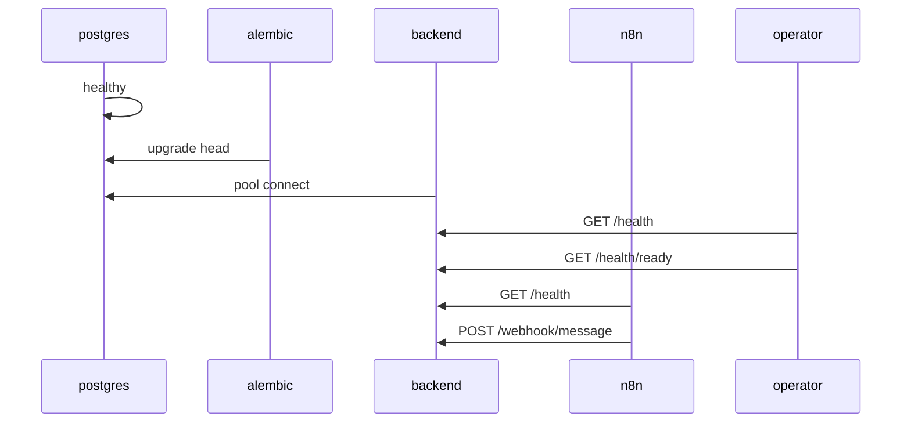

# Alpstein AI — Deployment Contract

**Document type:** canonical deployment contract (portable baseline)  
**Phase:** B2.0 — formalization only (no Docker artifacts, no runtime changes)  
**Status:** active specification  
**As-of:** 2026-05-27  
**Supersedes for portability:** informal host assumptions; defers to but does not replace `specs/architecture/deployment.md` for product vision — **this contract wins for env names, startup order, and rollback units** until specs are explicitly amended.

**Inputs:** B1 Deployment Portability Audit, `backend/app/core/config.py`, `docs/ops/*`, `docs/audits/runtime-reproducibility-audit.md`

**Target outcome:**

```text
new server → git clone → documented env → predictable startup sequence → docker compose reproducibility (B2.2+)
```

---

## 1. Contract scope and principles

### In scope

- Startup lifecycle and ownership
- Environment and secrets governance
- PostgreSQL and migration contract
- Health semantics (specified; implementation deferred to B2.4)
- Network boundaries (portable vs legacy host)
- Service responsibility boundaries
- Rollback-safe implementation phases (B2.0 … B2.9)
- Reproducible deployment unit (RDU) and rollback unit (RBU)

### Out of scope (explicit)

- Kubernetes, horizontal scaling, workers, Redis queues
- AI orchestration, PromptBuilder, or feature changes
- nginx/TLS implementation detail (referenced only)
- Immediate cutover of existing Contabo host layout

### Non-negotiable rules

1. **Specs and this contract** govern portable deployment; legacy host patterns are documented as **compatibility appendix** only.
2. **Secrets never in git** — templates (`.env.example`) list names only.
3. **Migrations are not optional** for a fresh database — schema comes from Alembic, not from app auto-create.
4. **n8n does not write PostgreSQL** in MVP.
5. **HubSpot n8n** (`integrationhubspot_n8n`, port `15678`) is out of scope — do not modify.

---

## 2. Startup lifecycle

### 2.1 Lifecycle phases

| Phase | Owner | Purpose |
|-------|--------|---------|
| **P0 — Infrastructure** | Operator / compose | Postgres volume, networks, secret files mounted |
| **P1 — Postgres ready** | Postgres service | Accept connections; data directory initialized |
| **P2 — Schema** | Migration job or entrypoint | `alembic upgrade head` |
| **P3 — Backend process** | Backend service | Uvicorn serves FastAPI |
| **P4 — Liveness** | Backend | Process responds without deep dependencies |
| **P5 — Readiness** | Backend | DB reachable; optional revision check (B2.4+) |
| **P6 — n8n** | n8n service | Workflows imported/activated; credentials bound |
| **P7 — Integration smoke** | Operator | Webhook path verified end-to-end |

### 2.2 Runtime ownership

| Concern | Owner at runtime |
|---------|------------------|
| HTTP API (webhook, health) | **Backend** (Python / FastAPI / uvicorn) |
| Business logic, AI orchestration, DB writes | **Backend** |
| Schema version | **Alembic** (executed before or at backend start — see §3) |
| Workflow transport, normalization, outbound messenger | **n8n** |
| Persistent workflow + credential store | **n8n volume** (`alpstein_n8n_data` or equivalent) |
| TLS termination, public routing | **nginx** (host or future container — not part of B2.2 minimal slice) |
| Demo/bootstrap business rows | **Operator scripts** (dev seed / SQL), not migrations |

### 2.3 What must not happen at startup

- Backend must **not** assume migrations ran implicitly without an explicit step in the deployment sequence.
- Backend must **not** auto-run dev seed in `production` environment.
- n8n must **not** start as the only service without a reachable backend URL.
- Multiple active Telegram Trigger workflows for the same bot (Telegram API constraint).

### 2.4 Current vs target startup (reference)

| Aspect | Legacy Contabo (documented, not portable) | **Contract target (B2.2+)** |
|--------|-------------------------------------------|------------------------------|
| Backend | Host uvicorn `0.0.0.0:8010` | Container `backend:8000` |
| Postgres | Shared `backend_postgres` / non-Alpstein DB name | Dedicated `postgres` service, DB `alpstein_ai` |
| n8n → backend | `http://172.20.0.1:8010` + UFW | `http://backend:8000` on compose network |
| Migrations | Manual operator | Declared step in compose/entrypoint contract |

---

## 3. Migration ownership

### 3.1 Canonical chain

Linear Alembic revisions — **never renumber** on a database that already applied them:

```text
0001 → 0002 → 0003 → 0004 → 0005 → 0006 → 0007 (head)
```

| Revision | Scope |
|----------|--------|
| 0001 | tenants, businesses |
| 0002 | customers |
| 0003 | conversations |
| 0004 | messages |
| 0005 | message idempotency index |
| 0006 | AI configuration, prompt_runs |
| 0007 | leads |

### 3.2 Ownership rules

| Action | Owner | When |
|--------|--------|------|
| Author new revision | **migration-engineer** + review | Feature/schema task only |
| Apply `upgrade head` | **Deployment entrypoint** or one-shot init job | Every fresh env; every deploy with new revision |
| Apply `downgrade` | **Operator** with explicit RBU | Emergency only; rehearsed |
| Data seed (demo businesses) | **Operator scripts** | Dev/local/test only |
| Content SQL (e.g. Alpstein demo profiles) | **Operator** | Documented in ops; not automatic |

### 3.3 Bootstrap data contract

Migrations create **schema only**. Minimum data for webhook smoke tests:

| `business_id` | Source | Required for |
|---------------|--------|--------------|
| `demo_barbershop_001` | `scripts/seed_dev_ai_configuration.py` (dev env only) | Test webhook / Gate 1 |
| `alpstein_ai_demo_001` | `scripts/demo_business_separation.sql` (+ optional content SQL) | Telegram ingress / product demo |

**Contract rule:** `POST /api/v1/webhook/message` returns `BUSINESS_NOT_FOUND` until the target `business_id` exists.

### 3.4 Driver and URL

- SQLAlchemy URL **must** use async driver: `postgresql+asyncpg://...`
- Same `ALPSTEIN_AI_DATABASE_URL` for Alembic and application (`backend/alembic/env.py` reads `settings.database_url`).

---

## 4. Health semantics

### 4.1 Endpoint contract (current and target)

| Endpoint | Status | Auth | Purpose |
|----------|--------|------|---------|
| `GET /api/v1/health` | **Implemented** | None | **Liveness** — process up; returns service name + environment |
| `GET /api/v1/health/ready` | **Implemented (B2.4)** | None | **Readiness** — DB `SELECT 1`; fail if DB unreachable |

**Current code behavior:** `/api/v1/health` remains liveness-only; orchestrators should use `/api/v1/health/ready` for DB readiness checks.

### 4.2 Response envelope (liveness)

```json
{
  "success": true,
  "data": {
    "status": "ok",
    "service": "alpstein-ai-backend",
    "environment": "<ALPSTEIN_AI_ENVIRONMENT>"
  }
}
```

### 4.3 Readiness rules (B2.4 implementation target)

Readiness **passes** when:

1. Liveness passes, and  
2. Database accepts a connection using `ALPSTEIN_AI_DATABASE_URL`, and  
3. (Optional strict mode) Alembic current revision equals repository `head`.

Readiness **must not** call OpenAI, n8n, or Telegram.

### 4.4 Orchestrator usage

| Check | Use for |
|-------|---------|
| Liveness | Container restart if process hung |
| Readiness | `depends_on` / load balancer / traffic enable |
| Webhook POST | Integration smoke only — requires token; not a health probe |

---

## 5. Environment ownership

### 5.1 Canonical environment model

Two **env file domains** (portable baseline):

| File | Services | Committed template |
|------|----------|-------------------|
| **Backend env** | `backend` | **`backend/.env.example`** (canonical); [`.env.example`](../../.env.example) is index only |
| **n8n env** | `alpstein_n8n` | **`n8n/.env.example`** |

Shared secrets that **must match** across both files:

- `N8N_BACKEND_API_TOKEN`

### 5.2 Variable classes

#### A — `ALPSTEIN_AI_` prefixed (backend `Settings`, pydantic `env_prefix`)

Resolved from environment as `ALPSTEIN_AI_<FIELD_NAME>` in uppercase.

| Contract name | Field | Required | Default | Notes |
|---------------|-------|----------|---------|-------|
| `ALPSTEIN_AI_DATABASE_URL` | `database_url` | **Yes** | localhost URL | Use hostname `postgres` in compose |
| `ALPSTEIN_AI_ENVIRONMENT` | `environment` | **Yes** | `production` | Controls seed guard, Langfuse auto-enable |
| `ALPSTEIN_AI_SERVICE_NAME` | `service_name` | No | `alpstein-ai-backend` | Health payload |

**Deprecated names (do not use in new deploys):** `DATABASE_URL`, `ENVIRONMENT` without prefix — listed in older specs only.

#### B — Unprefixed external aliases (backend `validation_alias`)

These names are used **exactly as shown** — no `ALPSTEIN_AI_` prefix.

| Name | Required | Owner | Notes |
|------|----------|-------|-------|
| `N8N_BACKEND_API_TOKEN` | **Yes** (webhook) | Backend + n8n | Header `X-Alpstein-Webhook-Token`; empty → 403 on webhook |
| `OPENAI_API_KEY` | **Yes** (live AI) | Backend only | |
| `OPENAI_MODEL` | No | Backend only | Default `gpt-4o-mini` |
| `AI_REQUEST_TIMEOUT` | No | Backend only | Seconds; default 30 |
| `LANGFUSE_PUBLIC_KEY` | No | Backend only | |
| `LANGFUSE_SECRET_KEY` | No | Backend only | |
| `LANGFUSE_HOST` | No | Backend only | Default `https://cloud.langfuse.com` |
| `LANGFUSE_TRACING_ENABLED` | No | Backend only | `true` forces tracing even in production |

#### C — n8n-only (not loaded by backend `Settings`)

| Name | Required | Notes |
|------|----------|-------|
| `BACKEND_BASE_URL` | **Yes** | No trailing slash; portable value `http://backend:8000` |
| `N8N_ENCRYPTION_KEY` | **Yes** | Stable across restarts for same volume |
| `N8N_BASIC_AUTH_USER` | **Yes** (admin) | |
| `N8N_BASIC_AUTH_PASSWORD` | **Yes** (admin) | |
| `TELEGRAM_CHAT_ID` | Owner notify | |
| `ALPSTEIN_TELEGRAM_BUSINESS_ID` | No | Default `alpstein_ai_demo_001` |
| `ALPSTEIN_TEST_BUSINESS_ID` | No | Test webhook default |

#### D — Reserved / not implemented

| Name | Status |
|------|--------|
| `SECRET_KEY` | Referenced in legacy specs; **not** in `Settings` — do not document as required until implemented |

### 5.3 Environment precedence

1. **Process environment** (compose `environment`, `env_file`, systemd `Environment=`) — highest.
2. **`.env` file** loaded by deployment tool (compose `env_file`) — must not be committed.
3. **Pydantic defaults** in `Settings` — lowest.

**Rule:** For portable deploys, all required variables must be set explicitly in `.env` — do not rely on defaults for `ALPSTEIN_AI_ENVIRONMENT` (default `production` suppresses dev seed).

### 5.4 Local / dev / prod separation

| `ALPSTEIN_AI_ENVIRONMENT` | Seed script | Langfuse auto-enable (if keys set) | Intended use |
|---------------------------|-------------|-----------------------------------|--------------|
| `development`, `dev`, `local`, `test` | Allowed | Yes | Local compose, CI, clone smoke |
| `production`, `staging`, other | **Blocked** | Only if `LANGFUSE_TRACING_ENABLED=true` | Production-like |

**Contract profiles (B2.5+):**

| Profile | Services | Seed |
|---------|----------|------|
| `default` | postgres + backend (+ n8n when integrated) | No |
| `bootstrap` | one-shot job | Yes — dev env only |
| `dev` | optional host port publish for debugging | Optional |

---

## 6. Secrets ownership

| Secret | Owner service | Storage | Rotation |
|--------|---------------|---------|----------|
| `N8N_BACKEND_API_TOKEN` | backend, n8n | `.env` / secret manager | Coordinated rotate both sides |
| `OPENAI_API_KEY` | backend | `.env` / secret manager | Backend only |
| `LANGFUSE_*` | backend | `.env` | Optional |
| `N8N_ENCRYPTION_KEY` | n8n | n8n `.env` | **Breaking** if changed without volume backup |
| Telegram bot tokens | n8n | n8n credentials DB | n8n UI |
| Postgres password | postgres, backend | compose env | Volume backup before rotate |
| TLS certificates | nginx | host certbot | Standard LE renewal |

**Rules:**

- Never commit `.env`, execution dumps, or credential-filled workflow JSON.
- Workflow exports in git: scrub secret values; credential IDs may be stripped.
- Logs: no tokens, API keys, or full message bodies with PII.
- `operator_business_context` may contain business contact PII — ops-owned in n8n Set node, not backend prompts.

---

## 7. PostgreSQL ownership

### 7.1 Portable service contract

| Attribute | Contract value |
|-----------|----------------|
| Service name | `postgres` |
| Image major | `15` (align with `postgres:15` baseline) |
| Database name | `alpstein_ai` |
| User | `alpstein` (or `POSTGRES_USER` from env template) |
| Port (internal) | `5432` |
| Port (host publish) | **Disabled** in production profile — internal network only |
| Volume | Named volume, e.g. `alpstein_postgres_data` |
| Init | Empty volume → migrations → optional bootstrap profile |

### 7.2 Legacy exclusion

The existing host container `backend_postgres` (non-`alpstein_ai` database name) is **not** the portable baseline. New compose stacks must use a **dedicated** Postgres instance/volume. Migration from legacy data is a separate operator project, not B2.2.

### 7.3 Backup and recovery

Minimum RBU for postgres: volume snapshot + recorded Alembic revision at backup time. Recovery: restore volume **or** recreate + `alembic upgrade head` + documented seed/SQL — see `docs/ops/database-recovery.md`.

---

## 8. Network boundaries

### 8.1 Canonical compose network (target)

```text
┌─────────────────────────────────────────────────────────┐
│  compose network: alpstein-internal (internal bridge)    │
│                                                          │
│   postgres:5432  ←──  backend:8000  ←──  alpstein_n8n:5678 │
│                          ↑                               │
│                    (no public bind)                      │
└─────────────────────────────────────────────────────────┘
         ↑ optional host publish (dev profile only)
```

### 8.2 Service naming and URLs

| Service | DNS name | Port | Consumer |
|---------|----------|------|----------|
| `postgres` | `postgres` | 5432 | backend |
| `backend` | `backend` | 8000 | n8n (`BACKEND_BASE_URL=http://backend:8000`) |
| `alpstein_n8n` | `alpstein_n8n` | 5678 | nginx → public HTTPS |

**Backend listen:** `0.0.0.0:8000` inside container.

**Canonical paths:**

- Liveness: `GET http://backend:8000/api/v1/health`
- Webhook: `POST http://backend:8000/api/v1/webhook/message`

### 8.3 Legacy host coupling — removal strategy

| Legacy pattern | Why it exists | Removal |
|----------------|---------------|---------|
| `BACKEND_BASE_URL=http://172.20.0.1:8010` | n8n container → host uvicorn | Replace with `http://backend:8000` when backend is on compose network |
| UFW `172.20.0.0/16 → 8010` | Allow Docker bridge to host | **Not required** when backend is a compose service |
| Host uvicorn on port **8010** | Historical deploy | Decommission after cutover; single port **8000** in contract |
| Second uvicorn on **8000** (`/backend/venv`) | Legacy stack | Document decommission; not part of RDU |
| `host.docker.internal` / `extra_hosts` | n8n compose workaround | Remove from portable n8n compose when backend is peer service |

**Phased removal:** B2.6 (backend+postgres compose) → B2.7 (n8n joins network) → operator decommissions host uvicorn + UFW rule.

### 8.4 Public edge

- **n8n admin:** HTTPS via nginx (`n8n.alpstein-ai.ch`) → `127.0.0.1:15679` or future internal proxy — unchanged conceptually.
- **Backend API:** not publicly exposed in MVP; nginx `api.*` is future.
- **Postgres:** never publicly accessible.

### 8.5 HubSpot isolation

| Resource | Port | Contract |
|----------|------|----------|
| `integrationhubspot_n8n` | 15678 | Do not modify, share volumes, or reuse compose project |

---

## 9. Deployment boundaries

### 9.1 Backend responsibility

- Validate normalized webhook payloads
- Tenant/business resolution, persistence, idempotency
- AI orchestration (configuration → prompt → gateway → PromptRun)
- Lead creation and notification policy flags in response
- Expose liveness (and readiness when implemented)
- **Must not:** call messenger APIs directly; run n8n workflows; depend on raw provider payloads

### 9.2 PostgreSQL responsibility

- Durable storage for all business data
- Enforce schema via migrations only
- **Must not:** be written by n8n in MVP

### 9.3 n8n responsibility

- External webhooks / Telegram trigger
- Payload normalization to `specs/api/webhooks.md` contract
- HTTP to backend with shared token
- Customer replies and owner notifications via provider APIs
- `operator_business_context` injection (business facts, contacts per ops policy)
- **Must not:** business rules, AI prompts, PostgreSQL writes, lead scoring

### 9.4 Operator responsibility

- Provide `.env` secrets (never in git)
- Run or automate migration + bootstrap profile on fresh env
- Import/activate canonical workflows; bind credentials
- Record execution IDs for gate evidence in `docs/ops/*`
- Maintain RDU/RBU tags; execute rollback as atomic bundle
- nginx/TLS, firewall, host-level backups

---

## 10. Canonical runtime sequence

Portable startup order — **mandatory** for clean-clone and future compose:

```text
1. postgres start
2. postgres health: pg_isready (or equivalent)
3. alembic upgrade head          [backend container entrypoint — B2.5]
4. (optional) bootstrap profile  [dev only: seed + documented SQL]
5. backend start (uvicorn via entrypoint exec)
6. liveness: GET /api/v1/health
7. readiness: GET /api/v1/health/ready   [B2.4+]
8. n8n start (depends on backend readiness or liveness per phase)
9. n8n: import canonical workflow exports, activate, bind credentials
10. integration smoke: test webhook + optional Telegram gate
```

**Dependency diagram:**



**n8n integration gate (minimum):** n8n may call backend only after step 6 passes; production traffic after step 7 (when available).

---

## 11. Rollback boundaries

### 11.1 Reproducible deployment unit (RDU)

A deployment is **reproducible** only when all of the following are identified together:

| # | Artifact |
|---|----------|
| 1 | Git commit or tag |
| 2 | Alembic revision at `head` for that commit |
| 3 | Canonical n8n workflow export file(s) + documented runtime workflow ID map |
| 4 | `backend/.env.example` + `n8n/.env.example` version (from same commit) |
| 5 | This contract document version (frontmatter date) |
| 6 | Compose file hash (B2.6+) |

### 11.2 Rollback unit (RBU)

Rollback is **atomic** — partial rollback is invalid for production-like verification.

```text
RBU = git tag/commit
    + alembic revision target (usually previous head)
    + n8n workflow export version
    + env template version (re-apply secrets from vault, not git)
    + postgres volume snapshot ID (if schema/data rollback)
    + rollback runbook section reference
```

| Layer | Rollback action | Re-run gates |
|-------|-----------------|--------------|
| Backend image/code | Redeploy previous tag | Liveness, readiness, one webhook |
| Migrations | `alembic downgrade` only if rehearsed | Full migration gate |
| n8n | Deactivate; re-import previous export | Gate 1/2 or T14 |
| Postgres | Restore volume snapshot | Migrations + seed/SQL |
| Secrets | Rotate + align both services | Health + webhook |

### 11.3 What rollback does not fix

- Polluted `messages` history (backend data issue)
- Lost `N8N_ENCRYPTION_KEY` without volume backup
- Telegram webhook conflicts from duplicate active workflows

---

## 12. Rollback-safe implementation phases

Implementation order — **do not skip**. No Docker implementation before B2.0 is accepted.

| Phase | Name | Deliverable | Rollback |
|-------|------|-------------|----------|
| **B2.0** | Deployment contract | This document | Revert doc commit |
| **B2.1** | Env governance in git | Track `.env.example` files; align names with §5; deprecate spec drift | Revert commit |
| **B2.2** | Postgres compose service | **done** — `docker-compose.yml` + `docker-compose.dev.yml`; see [`postgres-compose.md`](postgres-compose.md) | `docker-compose -p alpstein-ai down`; volume rm after backup |
| **B2.3** | Backend Dockerfile | **done** — `backend/Dockerfile`, `requirements-prod.txt`; see [`backend-image.md`](backend-image.md) | `docker rmi` previous tag |
| **B2.4** | Readiness health | `GET /api/v1/health/ready` + tests | Revert backend commit |
| **B2.5** | Backend entrypoint contract | **done** — `docker-entrypoint.sh`; see [`backend-image.md`](backend-image.md) | Revert entrypoint + image tag |
| **B2.6** | Minimal compose | **done** — `postgres` + `backend`; see [`postgres-compose.md`](postgres-compose.md) | `docker-compose -p alpstein-ai down`; volume snapshot |
| **B2.7** | n8n network integration | **done** — `n8n` on `alpstein_internal`; [`n8n-compose.md`](n8n-compose.md) | Revert to `baseline-b2.6-compose` |
| **B2.8** | Bootstrap profile | Documented seed/SQL order; compose profile | DB volume restore |
| **B2.9** | Clean-clone gate | `docs/audits/clean-clone-gate-*.md` pass transcript | Tag previous RDU |

**Freeze rule (from remediation plan):** During B2.2–B2.8, no unrelated backend feature work, migration edits, or n8n behavior changes unless exported and reconciled immediately.

### B2.0 exit criteria

- [ ] This contract reviewed and accepted by operator
- [x] Env name drift (`DATABASE_URL` vs `ALPSTEIN_AI_DATABASE_URL`) recorded in B2.1 backlog
- [x] Legacy host patterns documented in ops appendix (not removed until B2.7)
- [ ] RDU/RBU understood for first tagged portable baseline (target: post B2.9)

### B2.1 exit criteria

- [x] `backend/.env.example` and `n8n/.env.example` tracked with contract-aligned names
- [x] Root `.env.example` index points to canonical templates
- [x] Specs/ops mark deprecated names and legacy `8010` / `172.20.0.1` patterns
- [ ] Operator accepts templates (no Docker started)

### B2.2 exit criteria

- [x] Root `docker-compose.yml` defines `postgres` only (`postgres:15`, DB `alpstein_ai`)
- [x] Healthcheck `pg_isready -U alpstein -d alpstein_ai`
- [x] Named volume `alpstein_postgres_data`; network `alpstein_internal`
- [x] No host port in default file; dev overlay `docker-compose.dev.yml` optional
- [x] No backend service, Dockerfile, or runtime code changes
- [ ] Operator verifies `docker-compose -p alpstein-ai up -d postgres` on clean clone (not run on legacy prod by agent)

### B2.3 exit criteria

- [x] `backend/Dockerfile` — Python 3.12-slim, non-root, port 8000, uvicorn CMD only
- [x] `requirements-prod.txt` without pytest; `uvicorn[standard]` added for production
- [x] `backend/.dockerignore` excludes venv, tests, `.env`
- [x] `docker build` succeeds; `import app.main` passes without DB
- [x] Root `docker-compose.yml` unchanged (postgres only)
- [ ] Operator rebuild on clean clone for RBU tag

### B2.5 exit criteria

- [x] `backend/docker-entrypoint.sh` — `set -eu`, bounded `pg_isready` wait, `alembic upgrade head`, `exec uvicorn`
- [x] Migration failure prevents uvicorn start (non-zero exit)
- [x] No secrets logged from entrypoint
- [x] Dockerfile ENTRYPOINT; no migrations at image build
- [x] Root `docker-compose.yml` still postgres-only (superseded by B2.6)
- [ ] Operator full smoke: postgres + `docker run` backend on `alpstein_internal` (optional; use compose in B2.6)

### B2.6 exit criteria

- [x] `backend` service in root `docker-compose.yml` — build, `alpstein_backend`, `depends_on` postgres healthy
- [x] `ALPSTEIN_AI_DATABASE_URL` uses `postgres:5432` DNS (not host gateway)
- [x] Readiness healthcheck `GET /api/v1/health/ready` (httpx in-container)
- [x] Dev overlay `127.0.0.1:8000:8000` only; no public `0.0.0.0` bind
- [x] No n8n service in root compose (superseded by B2.7)
- [ ] Operator verifies `docker-compose -p alpstein-ai up -d postgres backend` on clean clone

### B2.7 exit criteria

- [x] `n8n` service in root `docker-compose.yml` on `alpstein_internal`
- [x] `BACKEND_BASE_URL=http://backend:8000` in portable path (`environment` override + `n8n/.env.example`)
- [x] Legacy `172.20.0.1:8010` documented as Contabo-only (`n8n/docker-compose.yml`, `n8n-runtime-start.md`)
- [x] No `extra_hosts` / host-gateway on portable n8n service
- [x] `depends_on: backend` with readiness healthcheck
- [x] No host port in default compose; dev overlay `15680` only
- [x] Live `alpstein_n8n` legacy compose untouched
- [ ] Operator verifies n8n → `GET http://backend:8000/api/v1/health/ready` on clean clone

---

## 13. Clean-clone acceptance criteria (forward reference)

Passed only when all succeed on a **fresh machine** with only git clone + documented `.env`:

| ID | Check |
|----|--------|
| G1 | `docker compose up` brings postgres healthy |
| G2 | Migrations reach `0007` head |
| G3 | `GET /api/v1/health` → 200 |
| G4 | `GET /api/v1/health/ready` → 200 (after B2.4) |
| G5 | `POST /api/v1/webhook/message` with test payload → `success: true` (token + seeded business) |
| G6 | n8n reaches backend via `BACKEND_BASE_URL` service URL |
| G7 | No manual UFW or host IP steps required |

Evidence: committed gate transcript in `docs/audits/`.

---

## 14. Related documents

| Topic | Path |
|-------|------|
| B1 audit | `docs/audits/runtime-reproducibility-audit.md` |
| Remediation sequencing | `docs/audits/runtime-baseline-remediation-plan.md` |
| DB recovery | `docs/ops/database-recovery.md` |
| n8n env checklist | `docs/ops/n8n-env-credential-checklist.md` |
| n8n runtime (legacy host) | `docs/ops/n8n-runtime-start.md` |
| Webhook API | `specs/api/webhooks.md` |
| Product deployment vision | `specs/architecture/deployment.md` |
| Backend settings source | `backend/app/core/config.py` |
| Ops release skill | `.cursor/skills/alpstein-ops-release-manager/SKILL.md` |

---

## 15. Contract changelog

| Date | Change |
|------|--------|
| 2026-05-27 | B2.0 initial formalization from B1 audit |
| 2026-05-27 | B2.1 — `backend/.env.example`, `n8n/.env.example`, root index; spec/ops drift markers |
| 2026-05-27 | B2.2 — `docker-compose.yml` postgres-only; [`postgres-compose.md`](postgres-compose.md) |
| 2026-05-27 | B2.3 — `backend/Dockerfile`, `requirements-prod.txt`; [`backend-image.md`](backend-image.md) |
| 2026-05-27 | B2.5 — `docker-entrypoint.sh` migrate-then-serve lifecycle |
| 2026-05-27 | B2.6 — `backend` service in root compose; [`postgres-compose.md`](postgres-compose.md) |
| 2026-05-27 | B2.7 — `n8n` service on `alpstein_internal`; [`n8n-compose.md`](n8n-compose.md) |

---

*End of deployment contract. Next phase: B2.8 — bootstrap profile.*
